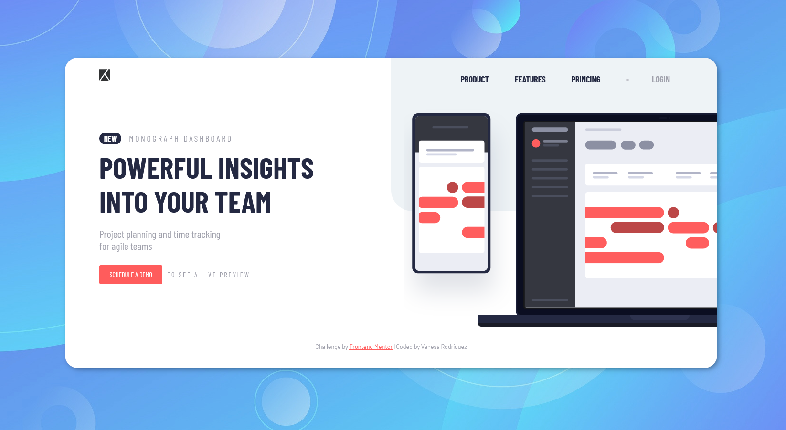
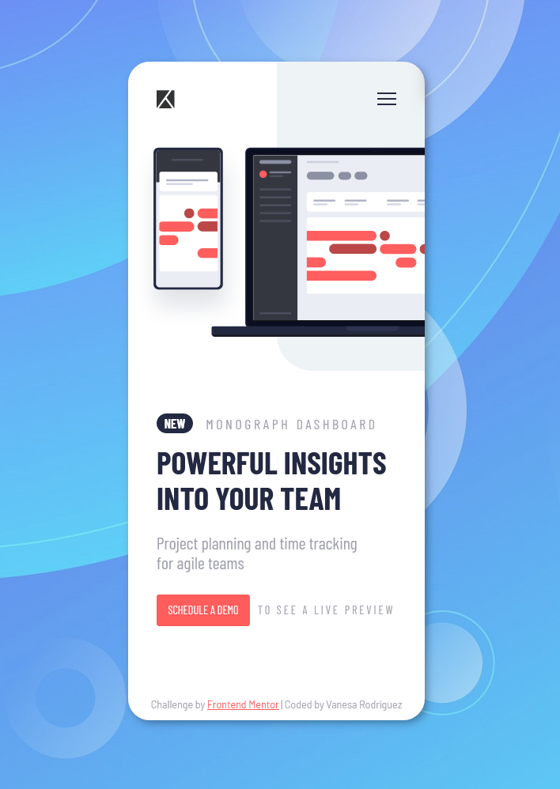

# Table of contents

- [Screenshots](#screenshots)
- [Built with](#built-with)
- [What I learned](#what-i-learned)
- [The challenge](#the-challenge)
- [Author](#author)


### Screenshots




## Built with

- Semantic HTML5 markup
- CSS custom properties
- Flexbox
- Mobile-first workflow
- JavaScript 


### What I learned


```css
   /* Efecto underline hover */
       .nav .menu__item a::after {
               content: "";
               position: absolute;
               bottom: 0;
               left: 50%;
               height: 2px;
               width: 0%;
               background-color: var(--midnight);
               transition: ease 0.5s;
       }
```

## The challenge

Users should be able to:

- View the optimal layout for the site depending on their device's screen size
- See hover states for all interactive elements on the page
- Create the background shape using code


## Author
Vanesa Rodríguez


